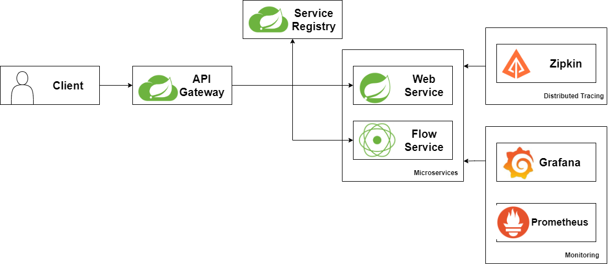

# ticket-backend

## 목표
- 서비스 간 독립적인 환경을 구성하기 위해 MSA (Micro Service Architecture) 를 구축한다
- 대기열 서비스는 Spring WebFlux 를 사용하고, 회원 관리, 티켓 관리 등 그 외는 Spring Mvc 를 사용한다
- 마이크로서비스 간 통신이 필요한 경우 Feign Client 도입을 고려한다
- API Gateway 를 사용하여 인증 & 인가 절차를 사전에 처리한다
- Zipkin, Prometheus, Grafana 를 도입하여 서비스를 분산 추적 및 모니터링한다
- 프로젝트가 시작되기 전에 반드시 ERD 를 README 파일에 업로드한다
- PR 이 진행될 때마다 반드시 아래 사항들을 실천한다
  - Test Code 를 작성하여 개발 비용을 낮춘다
  - mermaid chart 를 작성하여 변경점을 기록한다
  - PR 을 진행한 이유, 기술을 선택한 이유에 대해서 markdown 파일을 작성한다

## ERD

```mermaid
erDiagram
  BaseEntity {
    timestamp created_at "생성 시간"
    timestamp updated_at "수정 시간"
    timestamp removed_at "삭제 시간"
  }
  Team { 
    bigint id PK "팀 ID"
    string name "팀 이름"
  }
  Place { 
    bigint id PK "장소 ID"
    string name "장소 이름"
  }
  Game {
    bigint id PK "게임 ID"
    string type "게임 타입"
    string title "제목"
    bigint home_id FK "홈 팀"
    bigint away_id FK "상대 팀"
    bigint place_id FK "장소 ID"
    timestamp started_at "시작 시간"
  }
  Grade {
    bigint id PK "등급 ID"
    bigint place_id FK "장소 ID"
    string name "등급 이름"
  }
  Ticket {
    bigint id PK "티켓 ID"
    bigint game_id FK "게임 ID"
    bigint member_id FK "회원 ID"
    bigint grade_id FK "등급 ID"
    bigint payment_id FK "결제 ID"
    int price "가격"
    boolean is_reserved "예약 상태"
  }
  Member {
    bigint id PK "회원 ID"
    string name "회원 이름"
    string password "비밀번호"
    string email "이메일"
    string nickname "닉네임"
    string role "회원 등급"
  }
  Payment {
    bigint id PK "결제 ID"
    bigint member_id FK "회원 ID"
    bigint ticket_id FK "티켓 ID"
    string method "결제 방법"
    int amount "결제 금액"
  }
  
  Team ||--o{ Game: ""
  Place ||--o{ Game: ""
  Place ||--|{ Grade: ""
  Game ||--|{ Ticket: ""
  Member |o--o{ Ticket: ""
  Grade ||--|{ Ticket: ""
  Member ||--o{ Payment: ""
  Ticket ||--o| Payment: ""
```

## Architecture

